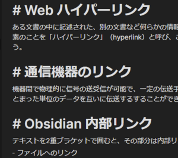

## ごあいさつ

Obsidianクイック・スタート・ガイドへようこそ！  
このPDFではアプリを初めてご利用される方に向けたチュートリアルをご紹介します。

### どんなアプリ？

Obsidianはテキスト、画像、外部Webサイトへのリンクなど、様々なデータをローカルファイルに保存するデジタルノートアプリ。  
Wikipediaのような内部リンクを中心に情報を管理するのが大きな特徴です。


つまりあなたが書いたノートはアプリ内でつながり、ノートを書けば書くほど成長してネットワークを作り上げていきます。


難しい知識なんて必要ありません。さあ、はじめましょう！

### 用意するもの

1. パソコン (Windows / Mac / Linux)
2. アプリケーション (ダウンロードURL: https://obsidian.md)

※ ObsidianはiOS / Androidに対応したモバイルアプリもリリースされておりますが、初めてご利用される方はパソコン版をおすすめします。

iOSアプリは[こちら](https://apps.apple.com/us/app/obsidian-connected-notes/id1557175442)

Androidアプリは[こちら](https://play.google.com/store/apps/details?id=md.obsidian)

<div style="page-break-after:always;color:lightgray" class="no-print">─────改ページ─────</div>

### 本書の目次

[TOC]

### 安全上のご注意

- <b>高温の場所 (火のそば、こたつの中、炎天下の車内など) で使用しないでください</b>  
  アプリは火災の原因にはなりませんが、熱中症になります。


- <b>分解、改造をしないでください</b>  
  アプリは火災の原因にはなりませんが、いろんな意味でやけどします。


- <b>強い力や衝撃を与えたり、投げつけないでください</b>  
  最初はみんな分かりません。


- <b>乳幼児の手の届かないところに保管してください</b>  
  恥ずかしいファイルがSNSで流出するおそれがあります。

<div style="page-break-after:always;color:lightgray" class="no-print">─────改ページ─────</div>

## 初回起動時 - 日本語化とVaultの作成

最初に初回起動時の設定を行います。


1. 言語を設定します。日本語化する場合はクリックして『日本語』を選択してください
2. 保管庫 (Vault) を新規作成します

### 保管庫 (Vault) とは？

パソコンの中でObsidianが使用するフォルダです。あなたが作成したテキストや画像、設定ファイルなどは全てこのフォルダに保存されます。

新規作成するには②をクリックして保管庫を作成したい場所を指定し、好きな名前を入力して「作成」をクリックしてください。


<div style="page-break-after:always;color:lightgray" class="no-print">─────改ページ─────</div>

## 各部の名称とはたらき


1. <b>メインウインドウ</b>  
   ノート (ファイル) を閲覧、編集する領域。Obsidianではこの領域をさらに分割し、複数のノートを同時に開くことができます。  
   ここに開かれたノートは『ペイン』という単位で管理されます。
2. <b>タイトルバー</b>  
   ペインごとに表示されるタイトルバー。ノートのタイトルを表示するのはもちろん、編集モードとプレビューモードの切り替え、その他ペインに対する様々な操作を行います。
3. <b>ツールバー</b>  
   左サイドバー開閉ボタンの他、プラグインや設定画面、ヘルプファイルにアクセスする様々なアイコンが並んでいます。
4. <b>左サイドバー</b>  
   ファイルエクスプローラや検索バーなど、様々な情報を表示します。
5. <b>右サイドバー</b>  
   初期状態では右サイドバーを開閉するボタンのみ表示されています。  
   ファイルエクスプローラや検索タブなど左サイドバーに表示できる情報は、ドラッグすることで右サイドバーに移動することも可能です。
6. <b>ファイルエクスプローラ、検索タブ</b>  
   ファイルエクスプローラは、保管庫内のフォルダやファイルを表示します。

<div style="page-break-after:always;color:lightgray" class="no-print">─────改ページ─────</div>

## 設定

画面左下、歯車マークのアイコンをクリックすると設定画面に移ります。  
ここでは初心者の方が扱いやすいと思われる設定例をご紹介します。太字の部分が変更箇所です。

### エディタ

| オプション名                                             | 設定値     |
| -------------------------------------------------------- | ---------- |
| <b>スペルチェック</b>                                    | <b>ON</b>  |
| 読みやすい行の長さ                                       | ON         |
| 厳密な改行                                               | OFF        |
| フロントマターを表示                                     | OFF        |
| 括弧を自動的にペアリング                                 | ON         |
| マークダウン記法を自動的にペアリング                     | ON         |
| スマートインデント                                       | ON         |
| <b>見出しのフォールド</b> (折りたたみ機能)               | <b>ON</b>  |
| <b>インデントのフォールド</b> (箇条書きの折りたたみ機能) | <b>ON</b>  |
| 新規ペインのデフォルトモード                             | エディタ   |
| 行番号の表示                                             | OFF        |
| タブの使用                                               | ON         |
| タブの間隔                                               | (変更無し) |
| 行の折り返し                                             | ON         |
| HTMLの自動変換                                           | ON         |
| Vimのキー設定                                            | OFF        |

<div style="page-break-after:always;color:lightgray" class="no-print">─────改ページ─────</div>

### ファイルとリンク

| オプション名                        | 設定値                            |
| ----------------------------------- | --------------------------------- |
| ファイル削除の確認                  | ON                                |
| <b>削除済みファイル</b>             | <b>Obsidianのゴミ箱に移動する</b> |
| <b>内部リンクを毎回更新する</b>     | <b>ON</b>                         |
| 新規ノートの作成場所                | 保管庫直下                        |
| 新規作成するリンクの形式            | 可能であれば最短経路              |
| [[ウィキリンク]]を使用              | ON                                |
| <b>すべてのファイル拡張子を認識</b> | <b>ON</b>                         |
| 新規添付ファイルの作成場所          | 保管庫直下                        |

### コアプラグイン

Obsidian標準プラグインの有効/無効を切り替えます。  
このガイドではデフォルトでOFFに設定されている機能のみ掲載しておりますので、ご自身の用途に合わせて有効にしてください。

| オプション名               | 設定値                                                       |
| -------------------------- | ------------------------------------------------------------ |
| アウトゴーイングリンク     | とりあえずON                                                 |
| タグペイン                 | タグを利用するならON                                         |
| デイリーノート             | 日付でノートを管理するならON                                 |
| テンプレート               | とりあえずON                                                 |
| スター                     | お気に入り機能を使うならON                                   |
| Zettelkastenプレフィクサー | 最初はOFFでOK [Zettelkastenとは？](https://gigazine.net/news/20200604-zettelkasten-note/) |
| ランダムノート             | 適当にページめくりしたいならON                               |
| アウトライン               | 見出しを目次として使うならON                                 |
| スライド                   | ノートをスライドとして使うならON                             |
| オーディオレコーダー       | 音声を録音するならON                                         |
| ワークスペース             | とりあえずON                                                 |
| パブリッシュ               | 保管庫をWebサイトとして公開。有料オプション                  |
| 同期                       | Obsidianのサーバを利用したファイル同期。有料オプション       |

<div style="page-break-after:always;color:lightgray" class="no-print">─────改ページ─────</div>

## ノートを作ってみよう！

キーボードショートカット`Ctrl + N` (Macなら`⌘ + N`)で新規ノートを作成します。ここでは例としてノートのタイトルを『Obsidian』とし、次のように記入します。

```markdown
# *Obsidian*とは
- **マークダウン記法**を用いてテキストを装飾し、リンクによってノート同士をつなげるデジタルノートアプリ
```


1行目は見出しと認識され、大きく表示されました。このように簡易的な印によってテキストを装飾するのがマークダウン記法です。  
画面をプレビューモードに切り替えると、


印は取り除かれ、スッキリとした見た目に変わりました。

### マークダウン記法によるテキスト装飾

| 機能              | 入力方法                                       |
| ----------------- | ---------------------------------------------- |
| 見出し (1～6まで) | # 見出し1 / ## 見出し2 / ### 見出し3           |
| 番号無しリスト    | \- リスト (Enterで次の項目、Tabで字下げ)       |
| 番号付きリスト    | 1. 番号付きリスト                              |
| 太字 / 斜体       | \**太字** と \*斜体\* (半角アスタリスクで囲む) |
| 引用              | > テキスト                                     |
| 段落              | (文末で) Enter                                 |
| 改行              | (文末で) スペース×2 →  Shift + Enter           |

その他の記法 : [Obsidian日本語ヘルプ > ノートをフォーマットする](https://publish.obsidian.md/help-ja/%E3%82%AC%E3%82%A4%E3%83%89/%E3%83%8E%E3%83%BC%E3%83%88%E3%82%92%E3%83%95%E3%82%A9%E3%83%BC%E3%83%9E%E3%83%83%E3%83%88%E3%81%99%E3%82%8B)

<div style="page-break-after:always;color:lightgray" class="no-print">─────改ページ─────</div>

## ノートをつなげてみよう！

### ファイルへのリンク

それではこのノートから新しいノートを作成し、ノート同士をリンクでつないでみましょう。  
編集画面に戻り、先ほどの文章の一部を`[[]]`(2重ブラケット)で囲みます。


この部分を`Ctrl`(Macなら`⌘`)を押しながらクリックすると、『リンク』という名前のノートが新規作成されます。今のところはリンクに関する情報を適当に記入しておきましょう。



これで先ほどの『Obsidian』ノートと『リンク』ノートはつながりを持ちました。グラフビューで確認してみると、


2つのノートが線でつながっています。


<div style="page-break-after:always;color:lightgray" class="no-print">─────改ページ─────</div>

### 見出しへのリンク

ノート同士をリンクさせるだけでは不十分な場面もあり得ます。例えば『リンク』という言葉は、文脈によって異なる複数の意味を持つはずです。

- 英単語 (link) の意味
- ゲーム (ゼルダの伝説) の主人公
- 通信機器のリンク (Bluetooth接続など)

先ほどは『Obsidian』ノートと、リンクに関する様々な情報を入力した『リンク』ノートをつなげました。しかしObsidianが文脈であるならば、リンク = 【Obsidianのリンク機能】と直接つながるのが最も妥当でしょう。  
ノートタイトルを『Obsidian リンク』などに変更するのも1つの手ですが、ここでは見出しへのリンクをご紹介します。

といっても操作は簡単です。『Obsidian』ノートを開き、「リンク」の後ろに#を入力します。


対象のノートに含まれる見出しがリストアップされました。  
『Obsidian 内部リンク』を選択すると、


このように表記が変化します。もう一度`Ctrl`(`⌘`)を押しながらクリックすると、


Obsidianのリンク機能がハイライトされました。

<div style="page-break-after:always;color:lightgray" class="no-print">─────改ページ─────</div>

## 簡易プレビューを使おう！

ページを行ったり来たりするのが面倒？ そんなときは簡易プレビューを使いましょう。

先ほどの『リンク』ノートを編集せず、プレビューするだけならクリックは不要です。`Ctrl` (`⌘`) を押しながらマウスカーソルを合わせれば、


対象ノートがポップアップでプレビューできます。さらにあらかじめプレビュー画面に切り替えておけば、キーを押す必要もありません。


この方法ではリンクした見出し内の情報のみが表示され、よりダイレクトに情報にアクセスできます。

## 最後に

このクイックスタートガイドでは、Obsidianの根幹であるマークダウン記法と内部リンクについてご紹介しました。  
これで少なくとも、あなたはObsidianというアプリを使い始めることができるはずです。

物足りない、もっと知りたいと思われたなら、ご安心ください。日本語ヘルプファイルがあなたの助けになるでしょう。

参考までに、逆引き索引をご用意しております。あなたの知りたいことに合わせてご活用ください。


<div style="page-break-after:always;color:lightgray" class="no-print">─────改ページ─────</div>

## 逆引き索引

### 基本機能

- <b>バックリンクって何？</b>  
  → [バックリンク](https://publish.obsidian.md/help-ja/%E3%83%97%E3%83%A9%E3%82%B0%E3%82%A4%E3%83%B3/%E3%83%90%E3%83%83%E3%82%AF%E3%83%AA%E3%83%B3%E3%82%AF)
- <b>コマンドパレットって何？</b>  
  →[コマンドパレット](https://publish.obsidian.md/help-ja/%E3%83%97%E3%83%A9%E3%82%B0%E3%82%A4%E3%83%B3/%E3%82%B3%E3%83%9E%E3%83%B3%E3%83%89%E3%83%91%E3%83%AC%E3%83%83%E3%83%88)
- <b>キーボードで操作したい</b>  
  → [キーボードショートカット](https://publish.obsidian.md/help-ja/%E3%82%AC%E3%82%A4%E3%83%89/%E3%82%AD%E3%83%BC%E3%83%9C%E3%83%BC%E3%83%89%E3%82%B7%E3%83%A7%E3%83%BC%E3%83%88%E3%82%AB%E3%83%83%E3%83%88)
- <b>複数のノートを同時に開きたい</b>  
  → [複数のノートを使った作業](https://publish.obsidian.md/help-ja/%E3%82%AC%E3%82%A4%E3%83%89/%E8%A4%87%E6%95%B0%E3%81%AE%E3%83%8E%E3%83%BC%E3%83%88%E3%82%92%E4%BD%BF%E3%81%A3%E3%81%9F%E4%BD%9C%E6%A5%AD)
- <b>マークダウン記法について詳しく知りたい</b>  
  → [ノートをフォーマットする](https://publish.obsidian.md/help-ja/%E3%82%AC%E3%82%A4%E3%83%89/%E3%83%8E%E3%83%BC%E3%83%88%E3%82%92%E3%83%95%E3%82%A9%E3%83%BC%E3%83%9E%E3%83%83%E3%83%88%E3%81%99%E3%82%8B)
- <b>フロントマターって何？</b>  
  → [YAMLフロントマター](https://publish.obsidian.md/help-ja/%E9%AB%98%E5%BA%A6%E3%81%AA%E3%83%88%E3%83%94%E3%83%83%E3%82%AF/YAML%E3%83%95%E3%83%AD%E3%83%B3%E3%83%88%E3%83%9E%E3%82%BF%E3%83%BC)  
  → [ノートにエイリアスを追加する](https://publish.obsidian.md/help-ja/%E3%82%AC%E3%82%A4%E3%83%89/%E3%83%8E%E3%83%BC%E3%83%88%E3%81%AB%E3%82%A8%E3%82%A4%E3%83%AA%E3%82%A2%E3%82%B9%E3%82%92%E8%BF%BD%E5%8A%A0%E3%81%99%E3%82%8B)
- <b>ファイルやWebページを埋め込みたい</b>  
  → [ファイルを埋め込む](https://publish.obsidian.md/help-ja/%E3%82%AC%E3%82%A4%E3%83%89/%E3%83%95%E3%82%A1%E3%82%A4%E3%83%AB%E3%82%92%E5%9F%8B%E3%82%81%E8%BE%BC%E3%82%80)  
  → [利用可能なファイルフォーマット](https://publish.obsidian.md/help-ja/%E9%AB%98%E5%BA%A6%E3%81%AA%E3%83%88%E3%83%94%E3%83%83%E3%82%AF/%E5%88%A9%E7%94%A8%E5%8F%AF%E8%83%BD%E3%81%AA%E3%83%95%E3%82%A1%E3%82%A4%E3%83%AB%E3%83%95%E3%82%A9%E3%83%BC%E3%83%9E%E3%83%83%E3%83%88)
- <b>Webページをキャプチャしたい</b>  
  → [情報のキャプチャ](https://publish.obsidian.md/help-ja/%E3%82%AC%E3%82%A4%E3%83%89/%E6%83%85%E5%A0%B1%E3%81%AE%E3%82%AD%E3%83%A3%E3%83%97%E3%83%81%E3%83%A3)

### プラグイン

- <b>他の公式プラグインを使いたい</b>  
  →[プラグインリスト](https://publish.obsidian.md/help-ja/%E3%83%97%E3%83%A9%E3%82%B0%E3%82%A4%E3%83%B3/%E3%83%97%E3%83%A9%E3%82%B0%E3%82%A4%E3%83%B3%E3%83%AA%E3%82%B9%E3%83%88)
- <b>サードパーティプラグインを使いたい</b>  
  → [サードパーティプラグイン](https://publish.obsidian.md/help-ja/%E9%AB%98%E5%BA%A6%E3%81%AA%E3%83%88%E3%83%94%E3%83%83%E3%82%AF/%E3%82%B5%E3%83%BC%E3%83%89%E3%83%91%E3%83%BC%E3%83%86%E3%82%A3%E3%83%97%E3%83%A9%E3%82%B0%E3%82%A4%E3%83%B3)

### その他

- <b>見た目を変更したい</b>  
  → [CSSのカスタマイズ](https://publish.obsidian.md/help-ja/%E9%AB%98%E5%BA%A6%E3%81%AA%E3%83%88%E3%83%94%E3%83%83%E3%82%AF/CSS%E3%81%AE%E3%82%AB%E3%82%B9%E3%82%BF%E3%83%9E%E3%82%A4%E3%82%BA)

- <b>別アプリからObsidianを操作したい</b>  
  → [Obsidian URIの利用](https://publish.obsidian.md/help-ja/%E9%AB%98%E5%BA%A6%E3%81%AA%E3%83%88%E3%83%94%E3%83%83%E3%82%AF/Obsidian+URI%E3%81%AE%E5%88%A9%E7%94%A8)

- <b>以前使っていたアプリからデータをインポートしたい</b>  
  → [データのインポート](https://publish.obsidian.md/help-ja/%E3%82%AC%E3%82%A4%E3%83%89/%E3%83%87%E3%83%BC%E3%82%BF%E3%81%AE%E3%82%A4%E3%83%B3%E3%83%9D%E3%83%BC%E3%83%88)

- <b>事故でデータが消えたら？</b>  
  → [ファイルリカバリー](https://publish.obsidian.md/help-ja/%E3%83%97%E3%83%A9%E3%82%B0%E3%82%A4%E3%83%B3/%E3%83%95%E3%82%A1%E3%82%A4%E3%83%AB%E3%83%AA%E3%82%AB%E3%83%90%E3%83%AA%E3%83%BC)

  